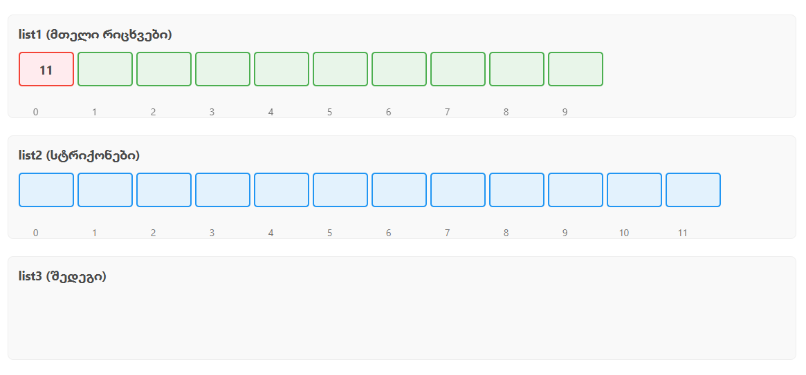

# Task #1 - List Management 📋

## 📁 Package
`oop.finalexam.t1`

## 📜 Description
This Java program performs list management operations between two lists: `list1` (of type `List<Integer>`) and `list2` (of type `List<String>`). It creates a third list, `list3`, using a specific algorithm with error handling for out-of-bound indices. The algorithm works in two major steps:

---

### ✅ Step 1 - Combine Elements
For each element in `list1`, the program treats its value as an index and attempts to access an element from `list2` using the formula:
`index_in_list2 = list1[i] + 1`

If the index is valid, it concatenates `list2[index] + list1[i]` and adds it to `list3`.

If the index is **out of bounds**, the program **skips** that value and prints an informative error message.

---

### ❌ Step 2 - Remove by Index
After populating `list3`, the program checks if any values from `list1` are valid indices for `list3`. If so, it removes the corresponding elements from `list3`.

The removal is done in **descending order** to avoid index shift errors during removal.

---

## 💥 Error Handling
The program handles cases where an index computed from `list1[i] + 1` is greater than the size of `list2`. In such cases:
- The program catches the `IndexOutOfBoundsException`
- It prints a message like:
`Skipping element 10 at position 2: index 11 is out of bounds for list2`
This ensures the program doesn’t crash and continues processing remaining elements.

---

## 🖼️ Error Handling Example Screenshot

Below is a screenshot of the program when it encounters out-of-bound index values:

## ✍️ Author
Tekla gogua
This solution was written as part of the OOP Final Exam (July 3, 2025).