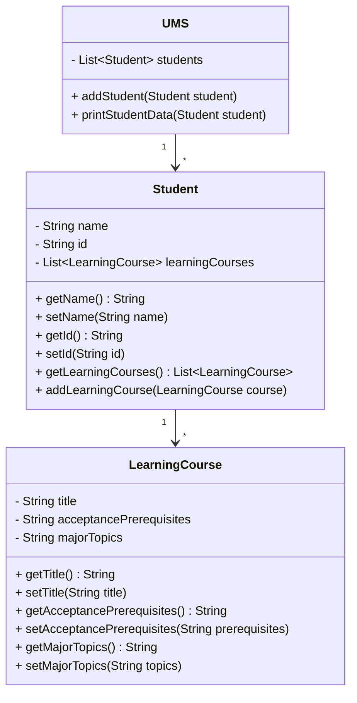

# 📚 University Management System (UMS)

## 📦 Package: `oop.finalexam.t2`

This is a Java-based **University Management System (UMS)** developed as part of a final Object-Oriented Programming (OOP) assignment. It demonstrates object-oriented principles like encapsulation, class composition, and data management using lists.

---

## ✅ Features

- Maintains a list of students.
- Each student can have multiple **Learning Courses**.
- Each course includes:
  - **Title** (String)
  - **Acceptance Prerequisites** (String)
  - **Major Topics** (String)
- `UMS` provides a method to print student data and their enrolled courses.
- When the student is **Tekla Gogua**, with student ID `01101117065`, **real course data from Argus** is automatically inserted and displayed.

---

## 🧩 Classes Overview

### 🔹 `UMS`
Responsible for managing students and displaying their course data.

- **Fields**:
  - `List<Student> students`
- **Methods**:
  - `addStudent(Student student)`
  - `printStudentData(Student student)`

### 🔹 `Student`
Represents a student with identifying information and course list.

- **Fields**:
  - `String name`
  - `String id`
  - `List<LearningCourse> learningCourses`
- **Methods**:
  - `addLearningCourse(LearningCourse course)`
  - Getters/Setters for name, id, and course list

### 🔹 `LearningCourse`
Represents a course with its main descriptive attributes.

- **Fields**:
  - `String title`
  - `String acceptancePrerequisites`
  - `String majorTopics`
- **Methods**:
  - Getters/Setters for all fields

---

## 👩‍🎓 Real Student Data

If a student has the following identity:

- **Name**: Tekla Gogua  
- **Student ID**: 01101117065

Then the system adds real courses from Argus, including:

1. **Object Oriented Programming (ENG)**
   - **Prerequisite**: CS50 Introduction to Programming
   - **Topics**: Java syntax and data structures; Classes; Encapsulation, inheritance; Files; Network; Terminal

2. **Calculus II (ENG)**
   - **Prerequisite**: MATH150 Calculus I
   - **Topics**: Lecture, seminars, demonstration, discussion, practical work

3. **Computer Organization (ENG)**
   - **Prerequisite**: CS50 Introduction to Programming
   - **Topics**: Machine-level programs; Optimization; Memory hierarchy

4. **Mathematical Foundation of Computing (ENG)**
   - **Prerequisite**: MATH150 Calculus I
   - **Topics**: Logic, Discrete Math, Set Theory, Graph Theory, Combinatorics

5. **English Language Course C1-2 (ENG)**
   - **Prerequisite**: N/A
   - **Topics**: N/A

---

## 📐 UML Diagram

👉 View the UML Diagram here:  
[🔗 UML on Google Docs](https://docs.google.com/document/d/1vAxGx9rMbvvvfeIx8sN5PU9IU8WDw8JbcHAlzA-VdNc/edit?usp=sharing)

**UML includes:**
- UMS class with methods
- Student class with course list
- LearningCourse with 3 fields
- Arrows showing relationships (has-a)

---

> Created by **Tekla Gogua** for the OOP Final Task 2  
> Ilia State University

